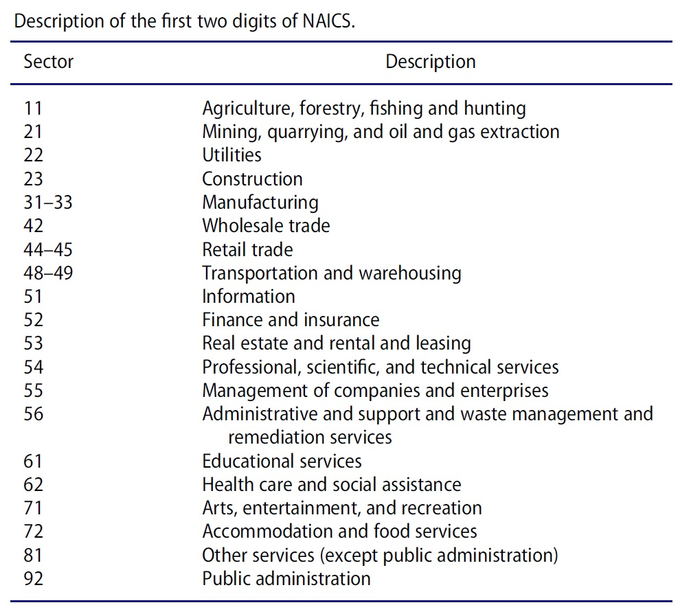

```{=html}
<style type="text/css">
h1.title {
  font-size: 20px;
  text-align: center;
}
h4.author { 
    font-size: 18px;
    text-align: center;
}
h4.date { 
  font-size: 18px;
  text-align: center;
}
h1 {
    font-size: 22px;
    text-align: center;
}
h2 {
    font-size: 18px;
    text-align: left;
}

div#TOC li {
    list-style:none;
}
</style>
```
```{r setup, include=FALSE}
# code chunk specifies whether the R code, warnings, and output 
# will be included in the output files.
if (!require("knitr")) {
   install.packages("knitr")
   library(knitr)
}

knitr::opts_chunk$set(echo = TRUE,       
                      warnings = FALSE,   
                      results = TRUE,   
                      message = FALSE,
                      fig.align='center', 
                      fig.pos = 'ht')
#knitr::opts_knit$set(root.dir = 'C:\\STA551\\wkdir0')
```


# Introduction


In this note, I will introduce the steps for taking random samples from the study population. The Bank load data set is treated as a population. We will use this data set as a population to implement various sampling plans.

The original data set was split into 9 subsets that are stored on GitHub. We first load these data sets to R and then combine them as a single data set.

```{r}
loan01 = read.csv("https://pengdsci.github.io/datasets/w06-SBAnational01.csv", header = TRUE)[, -1]
loan02 = read.csv("https://pengdsci.github.io/datasets/w06-SBAnational02.csv", header = TRUE)[, -1]
loan03 = read.csv("https://pengdsci.github.io/datasets/w06-SBAnational03.csv", header = TRUE)[, -1]
loan04 = read.csv("https://pengdsci.github.io/datasets/w06-SBAnational04.csv", header = TRUE)[, -1]
loan05 = read.csv("https://pengdsci.github.io/datasets/w06-SBAnational05.csv", header = TRUE)[, -1]
loan06 = read.csv("https://pengdsci.github.io/datasets/w06-SBAnational06.csv", header = TRUE)[, -1]
loan07 = read.csv("https://pengdsci.github.io/datasets/w06-SBAnational07.csv", header = TRUE)[, -1]
loan08 = read.csv("https://pengdsci.github.io/datasets/w06-SBAnational08.csv", header = TRUE)[, -1]
loan09 = read.csv("https://pengdsci.github.io/datasets/w06-SBAnational09.csv", header = TRUE)[, -1]
bankLoan = rbind(loan01, loan02, loan03, loan04, loan05, loan06, loan07, loan08, loan09)
# dim(bankLoan)
#names(bankLoan)
```


# Creating a meaningful and operational stratification variable


A stratification variable is a categorical variable that can be used to stratify the population based on its values. Each value (or category) defines a subpopulation. When sampling the population, we can take one random sub-sample from each sub-population and then combine these sub-samples to define a random sample of the population.

There are different ways of defining a stratification variable. For example, we can discretize a numerical variable, use an existing categorical variable, or modify an existing categorical variable by combining some of the categories in a meaningful way, etc. In this note, I use the North American Industry Classification System (NAICS) as an example to show you how to modify an existing categorical variable to define a stratification variable for sampling purposes.


## Description of Existing 2-Digit NAICS Codes


We first summarized the distribution of the existing NAICS in the following table.

```{r data-size}
naics =as.character(bankLoan$NAICS)  # make a character vector
N=length(naics)                      # find the size of the data. 
f.table = -sort(-table(naics))       # sort the vector in descending order
n = length(f.table)                       # find the number of distinct industries
n.0 = sum(f.table < 900)             # industry with less than 0.1% of the population size
# A note of the length of R variable name: the latest version of R has an upper bound 
# the maximum length of variable names from 256 characters to a whopping 10,000. 
# We should try our best to give meaningful names to R variables.
kable(cbind(Population.size = N, Number.of.Industries=n, Sub.Pop.less.900 = n.0))
```

I posted an article that used this data for the case study. One of the tables <https://github.com/pengdsci/STA490/blob/main/w06/w06-NAICS-Categories.jpg> in the article listed categories based on the first digits of NAICS code. The other related table gives the loan default rate in the corresponding industries <https://github.com/pengdsci/STA490/blob/main/w06/w06-NAICS-Default-Rates.jpg>. You can download these two tables to your local drive and include them in your R Markdown document if you want to practice and reproduce this report.

For the convenience of referring to these tables, I include these two tables in this document.

```{r echo=FALSE, fig.cap="List of all industries using the first two digits of the NAICS code", fig.align='center', out.width = '70%'}

```

```{r echo=FALSE, fig.cap="List of all industries using the first two digits of the NAICS code and the corresponding loan default rates", fig.align='center',out.width = '70%'}
include_graphics("w06/w06-NAICS-Default-Rates.jpg")
```

Next, we explore the frequency distribution of the 2-digit NAICS codes and decide the potential combinations of categories with a small size.


```{r}
NAICS.2.digits = substr(bankLoan$NAICS, 1, 2)   # extract the first two digits of the NAICS code
bankLoan$NAICS2Digit = NAICS.2.digits           # add the above two-digit variable the loan data
ftable = table(bankLoan$NAICS2Digit)
kable(t(ftable))
```

Several patterns you observe from the above table:

-   201948 businesses do not have a NAICS code. Since I will use the 2-digit NAICS code to stratify the population. This variable will be included in the study population that will be defined soon.

-   Several categories (21, 22, 49, 55, 92) have relatively small sizes. Since categories 48 and 49 are both transportation and warehouse industries, we will combine the two as indicated in the above two tables.

-   As we can see from the above two tables, several industries have different codes. We will combine these codes. In other words, we need to modify the 2-digit code to define the final stratification for stratified sampling.

## Combining Categories

We now combine the categories suggested in the above NAICS tables. Before we combine the NAICS codes, we present an example to illustrate how to combine categories using R.


```{r}
cate.vec0=c(1,4,3,6,7,3,6,5,4,6,4,5,8,9,4,3,4,7,3)  # vector of category labels
cate.vec=c(1,4,3,6,7,3,6,5,4,6,4,5,8,9,4,3,4,7,3)   # a copy of the vector of category labels
labs.2.collapse = c(1,6,7)                          # define a vector to store categories {1,6,7}
logic.vec=cate.vec %in% labs.2.collapse             # TRUE/FALSE ==> match not no-match
cate.vec[logic.vec] = 99                            # if matches (i.e., 1, 5, 7), the value 
                                                    # will be replaced by 99
matx=rbind(cate.vec0=cate.vec0, cate.vec=cate.vec)  # check the results
colnames(matx) = 1:length(cate.vec)                 # next kable() function requires a column names
kable(matx)
```


We now combine the actual 2-digit NAICS codes


```{r}
cate.31.33=c("31","32","33")                      # combining categories 31, 32, and 33
cate.48.49 = c("48", "49")
cate.44.45 = c("44", "45")
NAICS2Digit0 = bankLoan$NAICS2Digit                   # extract the 2-digit NAICS
NAICS2Digit =  bankLoan$NAICS2Digit                   # extract the 2-digit NAICS-copy
## combining 31,32,and 33
logic.31.33=NAICS2Digit %in% cate.31.33           # identify the three categories: 31, 32, 33.
NAICS2Digit[logic.31.33] = 313                      # replace 31, 32, 33 with 313
## combining 44 and 45
logic.44.45=NAICS2Digit %in% cate.44.45           # identify the three categories: 44 and 45.
NAICS2Digit[logic.44.45] = 445 
## combining 48 and 49
logic.48.49=NAICS2Digit %in% cate.48.49           # identify the three categories: 48 and 49.
NAICS2Digit[logic.48.49] = 489 
bankLoan$strNAICS = NAICS2Digit
```

## Loan Default Rates By Industry

We now find the loan default rates by industry defined by the stratification variable strNAICS. The loan default status can be defined by the variable MIS_Status.

```{r}
x.table = table(bankLoan$strNAICS, bankLoan$MIS_Status)
no.lab = x.table[,1]      # first column consists of unknown default label
default = x.table[,2]
no.default = x.table[,3]
default.rate = round(100*default/(default+no.default),1)
default.status.rate = cbind(no.lab = no.lab, 
                          default = default, 
                          no.default = no.default,
                          default.rate=default.rate)
kable(default.status.rate)
```

## Study Population

Based on the above frequency distribution of the modified 2-digit NAICS codes (the 3-digit codes are combined categories). We use the following inclusion rule to define the study population: excluding small-size categories 20, 21, 55, 92, and unclassified businesses with NAICS code 0.

```{r}
del.categories = c("0", "21", "22", "55", "92")       # categories to be deleted in 
                                                      # the original population
del.obs.status = !(bankLoan$strNAICS %in% del.categories) # deletion status. ! negation operator
study.pop = bankLoan[del.obs.status,]                     # excluding the categories
kable(t(table(study.pop$strNAICS)))                   # Checking correctness operation
```

So we have defined our study population!

# Sampling Plans

In this section, we are implementing three sampling plans. In each sampling plan, we select 4000 observations in the corresponding samples.

## Simple Random Sampling

We define a sampling list and add it to the study population.

```{r}
study.pop$sampling.frame = 1:length(study.pop$GrAppv)   # sampling list
# names(study.pop)                                      # checking the sampling list variable
sampled.list = sample(1:length(study.pop$GrAppv), 4000) # sampling the list
SRS.sample = study.pop[sampled.list,]                   # extract the sampling units (observations)
## dimension check
dimension.SRS = dim(SRS.sample)
names(dimension.SRS) = c("Size", "Var.count")
kable(t(dimension.SRS))                                        # checking the sample size
```

## Systematic sampling

```{r}
jump.size = dim(study.pop)[1]%/%4000   # find the jump size in the systematic sampling
# jump.size
rand.starting.pt=sample(1:jump.size,1) # find the random starting value
sampling.id = seq(rand.starting.pt, dim(study.pop)[1], jump.size)  # sampling IDs
#length(sampling.id)
sys.sample=study.pop[sampling.id,]    # extract the sampling units of systematic samples
sys.Sample.dim = dim(sys.sample)
names(sys.Sample.dim) = c("Size", "Var.count")
kable(t(sys.Sample.dim))
```

Because the jump size involves rounding error and the population is large, the actual systematic sample size is slightly different from the target size. In this report, I used the integer part of the actual jump size. The actual systematic sampling size is slightly bigger than the target size. We can take away some records random from the systematic sample to make the size to be equal to the target size.

## Stratified Sampling

We take an SRS from each stratum. The sample size should be approximately proportional to the size of the corresponding stratum.

First, we calculate the SRS size for each stratum and then take the SRS from the corresponding stratum.

```{r}
freq.table = table(study.pop$strNAICS)  # frequency table of strNAICS
rel.freq = freq.table/sum(freq.table)   # relative frequency 
strata.size = round(rel.freq*4000)      # strata size allocation
strata.names=names(strata.size)         # extract strNAICS names for accuracy checking
```

```{r}
kable(t(strata.size))  # make a nice-looking table using kable().
```

In the following code chunk, we take stratified samples.

```{r}
strata.sample = study.pop[1,]    # create a reference data frame
strata.sample$add.id = 1         # add a temporary ID to because in the loop
# i =2                           # testing a single iteration
for (i in 1:length(strata.names)){
   ith.strata.names = strata.names[i]   # extract data frame names
   ith.strata.size = strata.size[i]     # allocated stratum size
   # The following code identifies observations to be selected
   ith.sampling.id = which(study.pop$strNAICS==ith.strata.names) 
   ith.strata = study.pop[ith.sampling.id,]  # i-th stratified population
   ith.strata$add.id = 1:dim(ith.strata)[1]  # add sampling list/frame
   # The following code generates a subset of random ID
   ith.sampling.id = sample(1:dim(ith.strata)[1], ith.strata.size) 
   ## Create a selection status -- pay attention to the operator: %in% 
   ith.sample =ith.strata[ith.strata$add.id %in%ith.sampling.id,]
   ## dim(ith.sample)         $ check the sample
   strata.sample = rbind(strata.sample, ith.sample)  # stack all data frame!
 }
 # dim(strata.sample)
 strat.sample.final = strata.sample[-1,]     # drop the temporary stratum ID
 #kable(head(strat.sample.final))                    # accuracy check!
```


\


# Performance Analysis of Random Samples

In this section, we perform a comparative analysis of the three random samples. One metric we can use is the default rate in each industry defined by the first two digits of NAICS classification code. That was also used as the stratification variable in the stratified sampling plan. 

\

## Population-level Default Rates

We have calculated the default rate across the industries in the previous section. That table includes the category with no NAICS classification code. We will use these population-level industry-specific rates as a reference and compare them with the sample-level industry-specific default rates.  

```{r captio="Population level default rates"}
x.table = table(bankLoan$strNAICS, bankLoan$MIS_Status)
no.lab = x.table[,1]   # first column consists of unknown default label
default = x.table[,2]
no.default = x.table[,3]
default.rate = round(100*default/(default+no.default),1)
 default.status.rate = cbind(no.lab = no.lab, 
                          default = default, 
                          no.default = no.default,
                          default.rate=default.rate)
kable(default.status.rate, caption = "Population size, default counts, 
                                      and population default rates")
```

\

## Industry-Specific Default Rates based on SRS

For comparison, we construct the following table that includes the industry-specific default rates. 

```{r}
 # names(SRS.sample)
x.table = table(SRS.sample$strNAICS, SRS.sample$MIS_Status)
no.lab.srs = x.table[,1]      # first column consists of unknown default label
default.srs = x.table[,2]
no.default.srs = x.table[,3]
default.rate.srs = round(100*default.srs/(default.srs+no.default.srs),1)
##
industry.code = names(default.rate.srs)    # extract NSICS code
industry.name=c("Agri-forest-fish-hunt","Construction",
                "Manufacturing", "Wholesale-trade", "Retail-trade",
                "Transport-warehousing","Information", "Finance-insurance",
                "Real-estate-rental","Prof-sci-tech-ser",
                "Admin-support-waste-mgnt-remed", "Edu-serv",
                "Healthcare-social-assist","Arts-entertain-rec",
                "Accommodation-food-ser", "Other-ser(no-public-admin)")  # actual industry names!
default.rate.pop = default.rate[industry.code]
# cbind(industry.code,industry.name)
SRS.pop.rates = cbind(default.rate.pop,default.rate.srs)
rownames(SRS.pop.rates) = industry.name
kable(SRS.pop.rates, caption="Comparison of industry-specific default rates 
                               between population and the SRS.")
```

Some of the industry-specific default rates seem to be significantly different. More visual comparisons will be given in the next section.

\

## Industry-specific Rates- Systematics Sample

We will use the sample stratification variable to find the industry-specific rates based on the systematic sample. The following table will include rates of population, SRS, and systematic random samples.

```{r}
x.table = table(sys.sample$strNAICS, sys.sample$MIS_Status)
no.lab.sys = x.table[,1]      # first column consists of unknown default label
default.sys = x.table[,2]
no.default.sys = x.table[,3]
default.rate.sys = round(100*default.sys/(default.sys+no.default.sys),1)
sys.SRS.pop.rates = cbind(default.rate.pop, default.rate.srs, default.rate.sys)
rownames(SRS.pop.rates) = industry.name
kable(sys.SRS.pop.rates, caption="Comparison of industry-specific default rates 
                               between population, SRS, and Systematic Sample.")
```
It seems that the systematic sample performs better than the SRS sample.

\

## Industry-specific Default Rates- Stratified Sample

In this section, we put all information in the following table.

```{r}
#strat.sample.final
x.table = table(strat.sample.final$strNAICS, strat.sample.final$MIS_Status)
no.lab.str = x.table[,1]      # first column consists of unknown default label
default.str = x.table[,2]
no.default.str = x.table[,3]
default.rate.str = round(100*default.str/(default.str+no.default.str),1)
str.SRS.pop.rates = cbind(default.rate.pop, default.rate.srs, default.rate.sys, default.rate.str)
rownames(str.SRS.pop.rates) = industry.name
kable(str.SRS.pop.rates, caption="Comparison of industry-specific default rates 
                               between population, SRS, Systematic Sample, 
                               and Stratified Samples.")
```

\

# Visualization - Visual Comparison

In the previous section, we calculated the industry-specific default rates for population, SRS, systematic, and stratified samples. We now create a statistical graphic to compare the default rates among the samples.


```{r caption="Graphical comparison of industry-specific default rates among random samples and population. Caution: This chart is based on one-time samples. ", fig.width=8, fig.height=4, }
n=length(default.rate.pop)
#par(bg = 'gray')
# empty plot
plot(NULL, xlim=c(0,n), ylim=c(0, 50), xlab="", ylab ="", axes=FALSE)
title("Comparison of Industry-specific Default Rates")
points(1:n, as.vector(default.rate.pop), pch=16, col=2, cex = 0.8)
lines(1:n, as.vector(default.rate.pop), lty=1, col=2, cex = 0.8)
#
points(1:n, as.vector(default.rate.srs), pch=17, col=3, cex = 0.8)
lines(1:n, as.vector(default.rate.srs), lty=2, col=3, cex = 0.8)
#
points(1:n, as.vector(default.rate.sys), pch=19, col=4, cex = 0.8)
lines(1:n, as.vector(default.rate.sys), lty=3, col=4, cex = 0.8)
#
points(1:n, as.vector(default.rate.str), pch=20, col=5, cex = 0.8)
lines(1:n, as.vector(default.rate.str), lty=4, col=5, cex = 0.8)
#
axis(1,at=1:n, label=industry.code, las = 2)
axis(2)
#
rowMax=apply(str.SRS.pop.rates, 1, max) # max default rate in each industry
segments(1:n, rep(0,n), 1:n, rowMax, lty=2, col="lightgray", lwd = 0.5)
legend("topright", c("Pop", "SRS", "Sys", "Str"), lty=1:4, col=2:5, pch=c(16,17,19,20), cex=0.6, bty="n")

```

For ease of interpretation, I make the following table to map the NAICS codes and the corresponding industries.


```{r}
kable(cbind(industry.name, industry.code), 
      caption="Industry NAICS codes and the corresponding names")
```

Since the above graph is based on one-time samples, the variation is not included. Therefore, we need more information to do a meaningful comparison. For example, we can package the code in this Markdown document and take, say 1000, samples based on each sampling plan. We then can find the mean industry-specific default rates and the corresponding variation.

\

## Critiques of Visual Representation

Visual representation is a key component in effective storytelling. As an example, we critique the figure of performance comparison of the three sampling plans in the previous section and seek improvements for effective graphical representation. 

The following figure is modified based on the comparison line plot given in the previous section.


```{r caption=" Graphical comparison of industry-specific default rates among random samples and population. Caution: This chart is based on one-time samples. "}
n=length(default.rate.pop)
#par(bg = 'gray')
# empty plot
plot(NULL, xlim=c(0,n), ylim=c(0, 50), xlab="", ylab ="", axes=FALSE)

# Light gray background
rect(par("usr")[1], par("usr")[3], par("usr")[2], par("usr")[4], col = "gray")

# Add white grid
grid(nx = NULL, ny = NULL, col = "white", lwd = 1)

title("Comparison of Industry-specific Default Rates")
points(1:n, as.vector(default.rate.pop), pch=16, col=2, cex = 0.8)
lines(1:n, as.vector(default.rate.pop), lty=1, col=2, cex = 0.8)
#
points(1:n, as.vector(default.rate.srs), pch=17, col=3, cex = 0.8)
lines(1:n, as.vector(default.rate.srs), lty=2, col=3, cex = 0.8)
#
points(1:n, as.vector(default.rate.sys), pch=19, col=4, cex = 0.8)
lines(1:n, as.vector(default.rate.sys), lty=3, col=4, cex = 0.8)
#
points(1:n, as.vector(default.rate.str), pch=20, col=5, cex = 0.8)
lines(1:n, as.vector(default.rate.str), lty=4, col=5, cex = 0.8)
#
axis(1,at=1:n, label=industry.code, las = 2)
axis(2)
#
rowMax=apply(str.SRS.pop.rates, 1, max) # max default rate in each industry
segments(1:n, rep(0,n), 1:n, rowMax, lty=2, col="lightgray", lwd = 0.5)
legend("topright", c("Pop", "SRS", "Sys", "Str"), lty=1:4, col=2:5, pch=c(16,17,19,20), cex=0.6, bty="n")

```

There's a lot of ink here that doesn't convey information relevant to the main point we're trying to make. 

* **Gray background**: not only does it provide absolutely no information. it's also unsightly. After we remove it, we will likely have to darken some of the lines.

* **Grid lines**: it's very unlikely that our audience cares about the exact values at each data point - it's the pattern that matters. The grid lines compete with the pattern we're trying to show.

* **Legend**: It takes time to guess the abbreviation. It also confuses the audience.

* **Tick marks**: Why make the reader tilt his or her head to read?

* **Labels of x- and y- axis**: labels are missing. 

* **Title**: The title should be more specific.

* **Line types**: Use color and line type to differentiate - this will help people who have a color-impaired vision, and also any grey-scale copies of the poster you make (as for handouts).

* **Color coding**:  Avoid using use green and red colors in the same graphic to represent different objects. More than 99% of all color-blind people are suffering from a red-green color vision deficiency.


It's easy to make a graph that looks cleaner and has a higher ratio of information-to-total ink:


```{r fig.width=10, fig.height=4,  caption="Improved graphics"}
n=length(default.rate.pop)
plot(NULL, xlim=c(0,n), ylim=c(0, 50), 
     xlab="Industry Classification Code", 
     ylab ="Default Rates (Percentage)", axes=FALSE) # empty plot

# Light gray background
rect(par("usr")[1], par("usr")[3],  par("usr")[2], par("usr")[4], col = "gray")

# Add white grid
grid(nx = NULL, ny = NULL, col = "white", lwd = 1)

title("Comparison of Industry-specific Default Rates Based on Random Samples")
points(1:n, as.vector(default.rate.pop), pch=16, col="darkmagenta", cex = 0.8)
lines(1:n, as.vector(default.rate.pop),  lty=1, col="darkmagenta", cex = 0.8)
#
points(1:n, as.vector(default.rate.srs), pch=17, col="chartreuse4", cex = 0.8)
lines(1:n, as.vector(default.rate.srs), lty=1, col="chartreuse4", cex = 0.8)
#
points(1:n, as.vector(default.rate.sys), pch=19, col="darkblue", cex = 0.8)
lines(1:n, as.vector(default.rate.sys), lty=1, col="darkblue", cex = 0.8)
#
points(1:n, as.vector(default.rate.str), pch=20, col="darkcyan", cex = 0.8)
lines(1:n, as.vector(default.rate.str), lty=1, col="darkcyan", cex = 0.8)
#
#
axis(1, at=1:n, labels=industry.code)
#axis(1, at=1:n, labels=FALSE)
#text( (1:n), par("usr")[3], 
#     labels = industry.name, srt = 45, pos = 1, xpd = TRUE, adj = 1)

axis(2, las = 2)

# define a vector of colors
clr = c("darkmagenta","chartreuse4","darkblue","darkcyan")
rowMax=apply(str.SRS.pop.rates, 1, max) # max default rate in each industry

#segments(1:n, rep(0,n), 1:n, rowMax, lty=2, col="lightgray", lwd = 0.5)
legend(2, 45, c("Population", "Simple Random Sampling", "Systematic Sampling", "Stratified Sampling"), lty=rep(1,4), col=clr, pch=c(16,17,19,20), cex=0.6, bty="n")

```


```{r fig.width=10, fig.height=4,  caption="Improved graphics"}
n=length(default.rate.pop)
plot(NULL, xlim=c(0,n), ylim=c(0, 50), 
     xlab="Industry Classification Code", 
     ylab ="Default Rates (Percentage)", axes=FALSE) # empty plot

title("Comparison of Industry-specific Default Rates Based on Random Samples")
points(1:n, as.vector(default.rate.pop), pch=16, col="darkmagenta", cex = 0.8)
lines(1:n, as.vector(default.rate.pop),  lty=1, col="darkmagenta", cex = 0.8)
#
points(1:n, as.vector(default.rate.srs), pch=17, col="chartreuse4", cex = 0.8)
lines(1:n, as.vector(default.rate.srs), lty=1, col="chartreuse4", cex = 0.8)
#
points(1:n, as.vector(default.rate.sys), pch=19, col="darkblue", cex = 0.8)
lines(1:n, as.vector(default.rate.sys), lty=1, col="darkblue", cex = 0.8)
#
points(1:n, as.vector(default.rate.str), pch=20, col="darkcyan", cex = 0.8)
lines(1:n, as.vector(default.rate.str), lty=1, col="darkcyan", cex = 0.8)
#
axis(1,at=1:n, label=industry.code)
axis(2, las = 2)
#
clr = c("darkmagenta","chartreuse4","darkblue","darkcyan")
rowMax=apply(str.SRS.pop.rates, 1, max) # max default rate in each industry
#segments(1:n, rep(0,n), 1:n, rowMax, lty=2, col="lightgray", lwd = 0.5)
legend(2, 45, c("Population", "Simple Random Sampling", "Systematic Sampling", "Stratified Sampling"), lty=rep(1,4), col=clr, pch=c(16,17,19,20), cex=0.6, bty="n")

```

```{r fig.width=10, fig.height=4,  caption="Improved graphics"}
n=length(default.rate.pop)
plot(NULL, xlim=c(0,n), ylim=c(0, 50), 
     xlab="Industry Classification Code", 
     ylab ="Default Rates (Percentage)", axes=FALSE) # empty plot
# Light gray background
rect(par("usr")[1], par("usr")[3],
     par("usr")[2], par("usr")[4],
     col = "white")

# Add white grid
grid(nx = NULL, ny = NULL,
     col = "white", lwd = 1)
title("Comparison of Industry-specific Default Rates Based on Random Samples")
points(1:n, as.vector(default.rate.pop), pch=16, col="darkmagenta", cex = 0.8)
lines(1:n, as.vector(default.rate.pop),  lty=1, col="darkmagenta", cex = 0.8)
#
points(1:n, as.vector(default.rate.srs), pch=17, col="chartreuse4", cex = 0.8)
lines(1:n, as.vector(default.rate.srs), lty=1, col="chartreuse4", cex = 0.8)
#
points(1:n, as.vector(default.rate.sys), pch=19, col="darkblue", cex = 0.8)
lines(1:n, as.vector(default.rate.sys), lty=1, col="darkblue", cex = 0.8)
#
points(1:n, as.vector(default.rate.str), pch=20, col="darkcyan", cex = 0.8)
lines(1:n, as.vector(default.rate.str), lty=1, col="darkcyan", cex = 0.8)
#
axis(1,at=1:n, label=industry.code)
axis(2, las = 2)
#
clr = c("darkmagenta","chartreuse4","darkblue","darkcyan")
rowMax=apply(str.SRS.pop.rates, 1, max) # max default rate in each industry
#segments(1:n, rep(0,n), 1:n, rowMax, lty=2, col="lightgray", lwd = 0.5)
legend(2, 45, c("Population", "Simple Random Sampling", "Systematic Sampling", "Stratified Sampling"), lty=rep(1,4), col=clr, pch=c(16,17,19,20), cex=0.6, bty="n")

```

# Potential Inferential Procedures

Any idea for comparing the sampling plans based on rigorous statistical procedures, for example, the goodness of fit test to compare the quality of the sampling plans?

