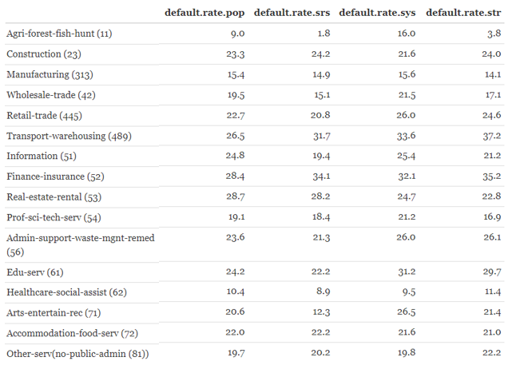

```{=html}
<style type="text/css">

div#TOC li {
    list-style:none;
    background-image:none;
    background-repeat:none;
    background-position:0;
}
h1.title {
  font-size: 24px;
  color: DarkRed;
  text-align: center;
}
h4.author { /* Header 4 - and the author and data headers use this too  */
    font-size: 18px;
  font-family: "Times New Roman", Times, serif;
  color: DarkRed;
  text-align: center;
}
h4.date { /* Header 4 - and the author and data headers use this too  */
  font-size: 18px;
  font-family: "Times New Roman", Times, serif;
  color: DarkBlue;
  text-align: center;
}

h1 { /* Header 3 - and the author and data headers use this too  */
    font-size: 20px;
    font-family: "Times New Roman", Times, serif;
    color: darkred;
    text-align: center;
}
h2 { /* Header 3 - and the author and data headers use this too  */
    font-size: 18px;
    font-family: "Times New Roman", Times, serif;
    color: navy;
    text-align: left;
}

h3 { /* Header 3 - and the author and data headers use this too  */
    font-size: 16px;
    font-family: "Times New Roman", Times, serif;
    color: navy;
    text-align: left;
}

</style>
```
```{r setup, include=FALSE}
# code chunk specifies whether the R code, warnings, and output 
# will be included in the output files.
if (!require("knitr")) {
   install.packages("knitr")
   library(knitr)
}
if (!require("grDevices")) {
   install.packages("grDevices")
   library(grDevices)
}

knitr::opts_chunk$set(echo = FALSE,      
                      warnings = FALSE,   
                      results = TRUE,   
                      message = FALSE,
                      fig.align='center', 
                      fig.pos = 'ht')
#knitr::opts_knit$set(root.dir = 'C:\\STA551\\wkdir0')
```


# Introduction

Analysis, We carry out an analysis by comparing the performance of three random sampling plans: simple random sampling (SRS), systematic sampling (SS), and stratified sampling based on a large bank load data set as the finite population.

The bank loan data set was provided by the U.S. Small Business Administration (SBA) which contains all historical loans endorsed by SBA from 1987 through 2014. This data set contains 27 variables and 899,164 observations. Each observation represents a loan that was guaranteed to some degree by the SBA. Detailed information about the data set can be found at (<https://pengdsci.github.io/datasets/LoanData-description.pdf>).

The original data set was split into 9 subsets that are stored on GitHub. We need to load these data sets to R and create a single data set.

```{r}
loan01 = read.csv("https://pengdsci.github.io/datasets/w06-SBAnational01.csv", header = TRUE)[, -1]
loan02 = read.csv("https://pengdsci.github.io/datasets/w06-SBAnational02.csv", header = TRUE)[, -1]
loan03 = read.csv("https://pengdsci.github.io/datasets/w06-SBAnational03.csv", header = TRUE)[, -1]
loan04 = read.csv("https://pengdsci.github.io/datasets/w06-SBAnational04.csv", header = TRUE)[, -1]
loan05 = read.csv("https://pengdsci.github.io/datasets/w06-SBAnational05.csv", header = TRUE)[, -1]
loan06 = read.csv("https://pengdsci.github.io/datasets/w06-SBAnational06.csv", header = TRUE)[, -1]
loan07 = read.csv("https://pengdsci.github.io/datasets/w06-SBAnational07.csv", header = TRUE)[, -1]
loan08 = read.csv("https://pengdsci.github.io/datasets/w06-SBAnational08.csv", header = TRUE)[, -1]
loan09 = read.csv("https://pengdsci.github.io/datasets/w06-SBAnational09.csv", header = TRUE)[, -1]
bankLoan = rbind(loan01, loan02, loan03, loan04, loan05, loan06, loan07, loan08, loan09)
#dim(bankLoan)
#names(bankLoan)
```

The objective of this analysis is to perform an empirical comparison of the three sampling plans using the loan default rate as a reference metric. The North American Industry Classification System (NAICS) code will be used to partition the population into several sub-populations. The discrepancies between the subpopulation default rates and corresponding sample rates under each of the three sampling plans reflect the goodness of the sampling plans.

Since this is an exploratory data analysis, we only use a graph to visually compare the three sampling plans.

In the next few sections, we will review the three sampling plans and perform some data management tasks to define the study population. The three random samples will then be drawn from the study populations. We will present the comparison using a graphical approach. Some discussions and remarks will be presented at the end of this report.

# Three Sampling Plans- A Review

In statistical inference, only random samples based on probabilistic sampling can be used to draw statistically valid results. There are several commonly used random sampling plans in practice. In this analysis, we use three of them: simple random sampling (SRS), systematic sampling, and stratified sampling.

## Simple Random Sampling

**Simple random sampling** is the best sample we can use in statistical analysis. When taking an SRS with size $n$ from a finite population, we assume **all possible** combinations of $n$ data points have an equally likely chance to be selected as the random sample for analysis.

In practice, a sample taken in such a way that each data point in the population has an equally likely chance to be included in the random sample is also called an SRS.

The following figure illustrates the the idea of SRS process.

```{r echo = FALSE, fig.align='center', out.width = '55%'}

```

\

## Systematic Sampling

The key step in the **Systematic sampling** is to find the **jump size m** which is approximately equal to the population size (**N**) divided by the size (**n**) of the random sample to be drawn from the population. That is, $m \approx N/n$ (keep only the integral part if it is a decimal). The next crucial step is to take a random number from the first m-th record and then choose every "m-th" record to be a part of the sample. The systematic random sample is valid since its first record is taken randomly.

The following figure shows the idea of a systematic sampling process.

```{r echo = FALSE, fig.align='center', out.width = '55%'}

```

The above figure has **jump size 3** and the first random subject is the third subject in the population, then the systematic sample is obtained by taking every third subject.

\

## Stratified Sampling

**Stratified random sampling** splits the entire population into several subpopulations in some situations in which an SRS is difficult to obtain. For example, when studying a rare disease, it is hard to get an SRS with a sufficient number of diseased subjects in the sample. In this case, we can use the **disease status** as a stratification variable and use its value to split the population into **diseased population** and **disease-free population**. With the two subpopulations, we take two SRS samples from both subpopulations and combine them to obtain a systematic sample.

```{r echo = FALSE, fig.align='center', out.width = '55%'}

```

One important note about stratified sampling is that the subsample must be proportional to the corresponding subpopulation size in order to obtain a combined sample similar to the SRS and systematic samples.

# Stratification Variable and Study Population

We need to define a stratification variable for stratified sampling. To define a stratification variable or modify an existing categorical variable, we need to make sure each category of the categorical variable should have enough subjects to be sampled. Therefore, we may need to exclude some small categories or combine some categories in a practically meaningful way. The final stratification variable also defines the study population.

## Stratification Variable

There are different ways of defining a stratification variable. For example, we can discretize a numerical variable, use an existing categorical variable, or modify an existing categorical variable. In this analysis, we modify the North American Industry Classification System (NAICS) to define a stratification variable for stratified sampling.

The NAICS is a 6-digit code. We use the first two digits of the code as a basis to define the stratification variable. The population contains 1312 different types of industries according to the 2-digit NAICS code and 1140 of them had less than 900 small businesses.

```{r data-size}
naics =as.character(bankLoan$NAICS)  # make a character vector
N=length(naics)                      # find the size of the data. 
f.table = -sort(-table(naics))       # sort the vector in descending order
n = length(f.table)                  # find the number of distinct industries
n.0 = sum(f.table < 900)             # industry with less than 0.1% of the population size
# A note of the length of R variable name: the latest version of R has an upper bound 
# the maximum length of variable names from 256 characters to a whopping 10,000. 
# We should try our best to give meaningful names to R variables.
#cbind(Population.size = N, Number.of.Industries=n, Sub.Pop.less.900 = n.0)
```

For the convenience of referring to these tables, I include these two tables in this document.

```{r echo=FALSE, fig.cap="List of all industries using the first two digits of the NAICS code", fig.align='center', out.width = '70%'}
include_graphics("SamplingReport/w06-NAICS-Categories.jpg")
```

```{r echo=FALSE, fig.cap="List of all industries using the first two digits of the NAICS code and the corresponding loan default rates", fig.align='center',out.width = '70%'}
include_graphics("SamplingReport/w06-NAICS-Default-Rates.jpg")
```

Next, we explore the frequency distribution of the 2-digit NAICS codes and decide the potential combinations of categories with a small size.

```{r}
NAICS.2.digits = substr(bankLoan$NAICS, 1, 2)   # extract the first two digits of the NAICS code
bankLoan$NAICS2Digit = NAICS.2.digits           # add the above two-digit variable the loan data
ftable = table(bankLoan$NAICS2Digit)
#kable(t(ftable))
```

```{r echo=FALSE, fig.align='center',out.width = '50%'}

```

-   201948 businesses do not have a NAICS code. Since I will use the 2-digit NAICS code to stratify the population. This variable will be included in the study population that will be defined soon.

-   Several categories (21, 22, 49, 55, 92) have relatively small sizes. Since categories 48 and 49 are both transportation and warehouse industries, we will combine the two as indicated in the above two tables.

-   As we can see from the above two tables, several industries have different codes. We will combine these codes. In other words, we need to modify the 2-digit code to define the final stratification for stratified sampling.

```{r}
cate.vec0=c(1,4,3,6,7,3,6,5,4,6,4,5,8,9,4,3,4,7,3)  # vector of category labels
cate.vec=c(1,4,3,6,7,3,6,5,4,6,4,5,8,9,4,3,4,7,3)   # a copy of the vector of category labels
labs.2.collapse = c(1,6,7)                          # define a vector to store categories {1,6,7}
logic.vec=cate.vec %in% labs.2.collapse             # TRUE/FALSE ==> match not no-match
cate.vec[logic.vec] = 99                            # if matches (i.e., 1, 5, 7), the value 
                                                    # will be replaced by 99
matx=rbind(cate.vec0=cate.vec0, cate.vec=cate.vec)  # check the results
colnames(matx) = 1:length(cate.vec)                 # next kable() function requires a column names
#kable(matx)
```

We now combine the actual 2-digit NAICS codes: **31, 32**, and **33** will be combined and renamed as **313**; **48** and **49** will be combined and renamed as **489**; **44** and **45** will be combined and renamed as **445**. We created a string variable **strNAICS** to represent these modified 2-digit NAICS industries.

```{r}
cate.31.33=c("31","32","33")                      # combining categories 31, 32, and 33
cate.48.49 = c("48", "49")
cate.44.45 = c("44", "45")
NAICS2Digit0 = bankLoan$NAICS2Digit                   # extract the 2-digit NAICS
NAICS2Digit =  bankLoan$NAICS2Digit                   # extract the 2-digit NAICS-copy
## combining 31,32,and 33
logic.31.33=NAICS2Digit %in% cate.31.33           # identify the three categories: 31, 32, 33.
NAICS2Digit[logic.31.33] = 313                      # replace 31, 32, 33 with 313
## combining 44 and 45
logic.44.45=NAICS2Digit %in% cate.44.45           # identify the three categories: 44 and 45.
NAICS2Digit[logic.44.45] = 445 
## combining 48 and 49
logic.48.49=NAICS2Digit %in% cate.48.49           # identify the three categories: 48 and 49.
NAICS2Digit[logic.48.49] = 489 
bankLoan$strNAICS = NAICS2Digit
```

## Study Population

Based on the above frequency distribution of the modified 2-digit NAICS codes (the 3-digit codes are combined categories). We use the following inclusion rule to define the **study population**: excluding small-size categories 20, 21, 55, 92, and unclassified businesses with NAICS code 0.

```{r}
del.categories = c("0", "21", "22", "55", "92")       # categories to be deleted in 
                                                      # the original population
del.obs.status = !(bankLoan$strNAICS %in% del.categories) # deletion status. ! negation operator
study.pop = bankLoan[del.obs.status,]                     # excluding the categories
kable(t(table(study.pop$strNAICS)))                   # Checking correctness operation
```

The study population has 694216 small businesses across 15 different industries with 29 variables including some derived variables for sampling purposes.

\

## Loan Default Rates by Industry: Study Population

We now find the loan default rates by industry defined by the stratification variable strNAICS. The loan default status can be defined by the variable MIS_Status.

```{r}
x.table = table(study.pop$strNAICS, study.pop$MIS_Status)
no.lab = x.table[,1]      # first column consists of unknown default label
default = x.table[,2]
no.default = x.table[,3]
default.rate = round(100*default/(default+no.default),1)
default.status.rate = cbind(no.lab = no.lab, 
                          default = default, 
                          no.default = no.default,
                          default.rate=default.rate)
kable(default.status.rate)
```

\

# Drawing Random Samples

we are implementing three sampling plans. In each sampling plan, we select 4000 observations in the corresponding samples.

Base R function `sample()` can be used to take SRS samples. To use this R function, we define observation ID numbered from 1 to 694216 so every small business in the study population has a unique ID. The three different samples will be drawn based on these IDs using `sample()`.

For ease of comparison, we keep adding the industry-specific default rates of individual samples to the industry-specific default rates of the study population.

-   **Simple Random Sampling**

We simply take random IDs and then identify the records based on the sampled IDs to obtain the SRS sample.

```{r}
study.pop$sampling.frame = 1:length(study.pop$GrAppv)   # sampling list
# names(study.pop)                                      # checking the sampling list variable
sampled.list = sample(1:length(study.pop$GrAppv), 4000) # sampling the list
SRS.sample = study.pop[sampled.list,]                   # extract the sampling units (observations)
## dimension check
dimension.SRS = dim(SRS.sample)
names(dimension.SRS) = c("Size", "Var.count")
#kable(t(dimension.SRS))                                        # checking the sample size
```

-   **Systematic sampling**

```{r}
jump.size = dim(study.pop)[1]%/%4000   # find the jump size in the systematic sampling
# jump.size
rand.starting.pt=sample(1:jump.size,1) # find the random starting value
sampling.id = seq(rand.starting.pt, dim(study.pop)[1], jump.size)  # sampling IDs
#length(sampling.id)
sys.sample=study.pop[sampling.id,]    # extract the sampling units of systematic samples
sys.Sample.dim = dim(sys.sample)
names(sys.Sample.dim) = c("Size", "Var.count")
#kable(t(sys.Sample.dim))
```

The **jump size** is calculated by $m = 694216/4000 =173.55$. The actual jump size is 173. We use `sample()`random take a record from the first 173 records and then select every 173rd record to include in the systematic sample.

-   **Stratified Sampling**

We take an SRS from each stratum. The sample size should be approximately proportional to the size of the corresponding stratum. First, we calculate the SRS size for each stratum and then take the SRS from the corresponding stratum. Then take SRS samples from the corresponding subpopulations.

```{r}
freq.table = table(study.pop$strNAICS)  # frequency table of strNAICS
rel.freq = freq.table/sum(freq.table)   # relative frequency 
strata.size = round(rel.freq*4000)      # strata size allocation
strata.names=names(strata.size)         # extract strNAICS names for accuracy checking
```

```{r}
#kable(t(strata.size))  # make a nice-looking table using kable().
```

```{r}
strata.sample = study.pop[1,]    # create a reference data frame
strata.sample$add.id = 1         # add a temporary ID to because in the loop
# i =2                           # testing a single iteration
for (i in 1:length(strata.names)){
   ith.strata.names = strata.names[i]   # extract data frame names
   ith.strata.size = strata.size[i]     # allocated stratum size
   # The following code identifies observations to be selected
   ith.sampling.id = which(study.pop$strNAICS==ith.strata.names) 
   ith.strata = study.pop[ith.sampling.id,]  # i-th stratified population
   ith.strata$add.id = 1:dim(ith.strata)[1]  # add sampling list/frame
   # The following code generates a subset of random ID
   ith.sampling.id = sample(1:dim(ith.strata)[1], ith.strata.size) 
   ## Create a selection status -- pay attention to the operator: %in% 
   ith.sample =ith.strata[ith.strata$add.id %in%ith.sampling.id,]
   ## dim(ith.sample)         $ check the sample
   strata.sample = rbind(strata.sample, ith.sample)  # stack all data frame!
 }
 # dim(strata.sample)
 strat.sample.final = strata.sample[-1,]     # drop the temporary stratum ID
 #kable(head(strat.sample.final))                    # accuracy check!
```

\

# Performance Analysis of Random Samples

In this section, we perform a comparative analysis of the three random samples. One metric we can use is the default rate in each industry defined by the first two digits of NAICS classification code. That was also used as the stratification variable in the stratified sampling plan.

We have calculated the default rate across the industries in the previous section. That table includes the category with no NAICS classification code. We will use these population-level industry-specific rates as a reference and compare them with the sample-level industry-specific default rates. The summarized table with population and sample level default rates are given below.

```{r captio="Population level default rates"}
x.table = table(study.pop$strNAICS, study.pop$MIS_Status)
no.lab = x.table[,1]   # first column consists of unknown default label
default = x.table[,2]
no.default = x.table[,3]
default.rate = round(100*default/(default+no.default),1)
 default.status.rate = cbind(no.lab = no.lab, 
                          default = default, 
                          no.default = no.default,
                          default.rate=default.rate)
#kable(default.status.rate, caption = "Population size, default counts, 
#                                      and population default rates")
```

```{r}
 # names(SRS.sample)
x.table = table(SRS.sample$strNAICS, SRS.sample$MIS_Status)
no.lab.srs = x.table[,1]      # first column consists of unknown default label
default.srs = x.table[,2]
no.default.srs = x.table[,3]
default.rate.srs = round(100*default.srs/(default.srs+no.default.srs),1)
##
industry.code = names(default.rate.srs)    # extract NSICS code
industry.name=c("Agri-forest-fish-hunt (11)","Construction (23)",
                "Manufacturing (313)", "Wholesale-trade (42)", "Retail-trade (445)",
                "Transport-warehousing (489)","Information (51)", "Finance-insurance (52)",
                "Real-estate-rental (53)","Prof-sci-tech-serv (54)",
                "Admin-support-waste-mgnt-remed (56)", "Edu-serv (61)",
                "Healthcare-social-assist (62)","Arts-entertain-rec (71)",
                "Accommodation-food-serv (72)", "Other-serv(no-public-admin (81))")  # actual industry names!
default.rate.pop = default.rate[industry.code]
# cbind(industry.code,industry.name)
SRS.pop.rates = cbind(default.rate.pop,default.rate.srs)
rownames(SRS.pop.rates) = industry.name
#kable(SRS.pop.rates, caption="Comparison of industry-specific default rates 
#                               between population and the SRS.")
```

```{r}
x.table = table(sys.sample$strNAICS, sys.sample$MIS_Status)
no.lab.sys = x.table[,1]      # first column consists of unknown default label
default.sys = x.table[,2]
no.default.sys = x.table[,3]
default.rate.sys = round(100*default.sys/(default.sys+no.default.sys),1)
sys.SRS.pop.rates = cbind(default.rate.pop, default.rate.srs, default.rate.sys)
rownames(SRS.pop.rates) = industry.name
#kable(sys.SRS.pop.rates, caption="Comparison of industry-specific default rates 
#                               between population, SRS, and Systematic Sample.")
```

```{r}
#strat.sample.final
x.table = table(strat.sample.final$strNAICS, strat.sample.final$MIS_Status)
no.lab.str = x.table[,1]      # first column consists of unknown default label
default.str = x.table[,2]
no.default.str = x.table[,3]
default.rate.str = round(100*default.str/(default.str+no.default.str),1)
str.SRS.pop.rates = cbind(default.rate.pop, default.rate.srs, default.rate.sys, default.rate.str)
rownames(str.SRS.pop.rates) = industry.name
## after the table was created, I made an image to include in the document since it a random table 
#kable(str.SRS.pop.rates, caption="Comparison of industry-specific default rates 
#                               between population, SRS, Systematic Sample, 
#                               and Stratified Samples.")
```


```{r echo=FALSE, fig.align='center',out.width = '90%'}

```

First of all, we note that the above table of default rates based on random samples are random. The follow observations are solely based on this random table.

* The sample default rate in some industries have a very large variations comparing with the true default rates at the population level. For example in categories of **agri-forest-fish-hunt**,  **Transport-warehousing**, **Edu-serv**, and **Arts-entertain-serv**.

* The sample default rates are close to that of the population rates. We will not test the significance of the differences between the default rates between the population and samples.


```{r results = FALSE, fig.width=10, fig.height=4,  caption="Improved graphics"}
n=length(default.rate.pop)
png()  # open PNG graphic device and save the following figure to a file in a folder in the local drive.
       # you can check the help document by typing ?png in R Console to see how to use it.
       # after open any graphic device, the figure will not show in the knitted document.
plot(NULL, xlim=c(0,n), ylim=c(0, 50), 
     xlab="Industry Classification Code", 
     ylab ="Default Rates (Percentage)", axes=FALSE) # empty plot
# Light gray background
rect(par("usr")[1], par("usr")[3],
     par("usr")[2], par("usr")[4],
     col = "white")

# Add white grid
grid(nx = NULL, ny = NULL,
     col = "white", lwd = 1)
title("Comparison of Industry-specific Default Rates Based on Random Samples")
points(1:n, as.vector(default.rate.pop), pch=16, col="darkmagenta", cex = 0.8)
lines(1:n, as.vector(default.rate.pop),  lty=1, col="darkmagenta", cex = 0.8)
#
points(1:n, as.vector(default.rate.srs), pch=17, col="blue", cex = 0.8)
lines(1:n, as.vector(default.rate.srs), lty=1, col="blue", cex = 0.8)
#
points(1:n, as.vector(default.rate.sys), pch=19, col="orange3", cex = 0.8)
lines(1:n, as.vector(default.rate.sys), lty=1, col="orange3", cex = 0.8)
#
points(1:n, as.vector(default.rate.str), pch=20, col="darkgreen", cex = 0.8)
lines(1:n, as.vector(default.rate.str), lty=1, col="darkgreen", cex = 0.8)
#
axis(1,at=1:n, label=industry.code)
axis(2, las = 2)
#
clr = c("darkmagenta","blue","orange3","darkgreen")
rowMax=apply(str.SRS.pop.rates, 1, max) # max default rate in each industry
#segments(1:n, rep(0,n), 1:n, rowMax, lty=2, col="lightgray", lwd = 0.5)
legend(2, 45, c("Population", "Simple Random Sampling", "Systematic Sampling", "Stratified Sampling"), lty=rep(1,4), col=clr, pch=c(16,17,19,20), cex=0.6, bty="n")
dev.off()    # close the graphic device
```

```{r results = FALSE, fig.width=10, fig.height=4,  caption="MSE Comparison"}
## Plotting MSE of difference of default rates across industries
srs.diff = as.vector(default.rate.pop) - as.vector(default.rate.srs)
sys.diff = as.vector(default.rate.pop) - as.vector(default.rate.sys)
str.diff = as.vector(default.rate.pop) - as.vector(default.rate.str)
#summary(c(srs.diff, sys.diff, str.diff))
MSE = c(mean(srs.diff^2), mean(sys.diff^2), mean(str.diff^2))
png()  # open PNG graphic device and save the following figure to a file in a folder in the local drive.
       # you can check the help document by typing ?png in R Console to see how to use it.
       # after open any graphic device, the figure will not show in the knitted document.
plot(NULL, xlim=c(0,4), ylim=c(0,40), main="MSE of the difference of default rates", axes = FALSE, xlab="Sampling Plans", ylab="MSE")
axis(1, at=0:4, labels = c(" ", "SRS", "SYS", "STR", ""))
axis(2)
segments(c(1,2,3), c(0, 0, 0), c(1,2,3), MSE, lwd = 4, col = "navy")
dev.off() # turn off the graphic device
```


```{r echo=FALSE, fig.align='center',out.width = '90%'}

```


The above patterns of industry-specific default rates are also reflected in the following line plot (top panel). 

To see the overall performance among the three sampling plans based on these single-step samples (under each of the three sampling plans), we look at the mean square errors of the differences in the default rates between the population and each of the three random samples. The result is summarized in the bottom panel of the above figure. It turns out that the SRS and systematic sampling plans outperform the stratified sampling plan.

**A cautionary note**: The above-observed pattern about the discrepancy of population and sample rates could be changed significantly across the samples.


# Discussions and Concluding Remarks

We have implemented the three well-known sampling plans that are commonly used in practice based on a large SBA bank loan data. The NAICS industry code was used to define the study population and the stratification variable for stratified sampling. The difference between population-level industry-specific default rates and sample-level rates was used to compare the performance of the sampling plans.

The comparison results were based on the one-step sample, there could be significant variations. A more reliable approach to obtaining a stable overall performance of the three sampling plans is to take multiple samples and compare the mean MSEs.


