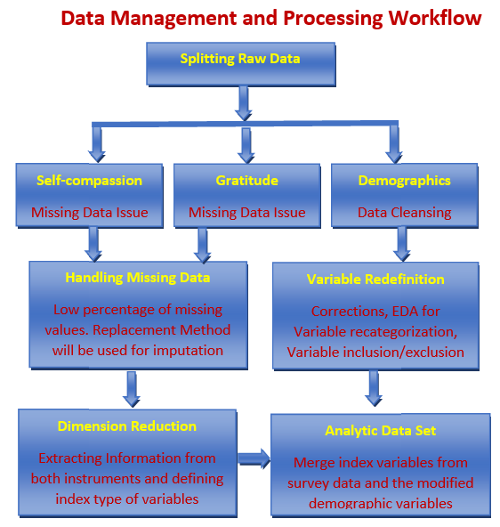

```{=html}
<style type="text/css">

div#TOC li {
    list-style:none;
    background-image:none;
    background-repeat:none;
    background-position:0;
}
h1.title {
  font-size: 24px;
  color: DarkRed;
  text-align: center;
}
h4.author { /* Header 4 - and the author and data headers use this too  */
    font-size: 18px;
  font-family: "Times New Roman", Times, serif;
  color: DarkRed;
  text-align: center;
}
h4.date { /* Header 4 - and the author and data headers use this too  */
  font-size: 18px;
  font-family: "Times New Roman", Times, serif;
  color: DarkBlue;
  text-align: center;
}

h1 { /* Header 3 - and the author and data headers use this too  */
    font-size: 20px;
    font-family: "Times New Roman", Times, serif;
    color: darkred;
    text-align: center;
}
h2 { /* Header 3 - and the author and data headers use this too  */
    font-size: 18px;
    font-family: "Times New Roman", Times, serif;
    color: navy;
    text-align: left;
}

h3 { /* Header 3 - and the author and data headers use this too  */
    font-size: 16px;
    font-family: "Times New Roman", Times, serif;
    color: navy;
    text-align: left;
}

</style>
```


```{r setup, include=FALSE}
library(tidyverse)
library(GPArotation)
library(psych)
library(nFactors)
library(rmarkdown)
library(knitr)
library(parameters)
library(corrplot)
library(ggcorrplot)
library(ggfortify)
require(ggplot2)
require(GGally) 
require(CCA)
require(olsrr)
require(cocron)
opts_chunk$set(echo = TRUE, warning=FALSE, results =TRUE)
```


# Introduction

The goal of this research project is to measure the level of self-compassion as well as the self-care of BSW and MSW students in a Social Work Program at a
regional University. We will be using the following two reliable and validated instruments to measure their level of self-compassion and self-care as they
immerse themselves in the helping profession. We hope to see how the SC of the students correlates to other independent variables i.e. undergrad/grad
program social work, age, education level, religiosity, spirituality, gender, etc.

1. The Self-Compassion Scale
2. The Gratitude Questionnaire

The purpose of our research is to study the perception of self-compassion in social work students and how it can link to self-care as well as success in the social work program and field. This will help provide students with self-care practices during their training to thrive in the profession in the future.


# Data Management and Analyzing Survey Instruments

\

The next chart illustrates the data management workflow to create the analytic data set.

```{r fig.align='center', out.width = '50%'}

```


```{r}
survey = read.csv("w09-SurveyDataCsvFinal.csv", head = TRUE)
# names(survey)
```

The original survey data have three components, a self-compassion scale and gratitude questionnaire instruments, and some demographic questions. 

The three components have different portions of missing values. We split the original data set into three subsets of data and impute the missing values related to the self-compassion and gratitude data based on the survey instruments. Since there are only a few missing values, we replace the missing values in each survey question with the mode of the associated survey item. We create indexes of the two instruments separately to aggregate the information in the two survey data sets. 

Since R does not have a function to find the model of a given data set, I write the following function to find the model of a data set.

We will perform both principal component analysis (PCA) and exploratory factor analysis (EFA).


```{r}
my.mode = function(dataset){
  freq.tbl = table(dataset)
  max.freq.id=which(freq.tbl==max(freq.tbl))
  mode=names(freq.tbl[max.freq.id])
  as.numeric(mode)
}
```

## Handling Missing Values Self-Compassion Instrument

This instrument contains only the data associated with the 12 items in the survey instrument. In the original data file, the 12 variables are named Q2_1, Q2_2, ..., Q2_12. We impute the missing value by replacing the missing value in each of the 12 items with the mode of the corresponding survey items. Since there are only a few missing values in this instrument, this imputation will not impact the subsequent PCA and EFA.  

```{r}
compassion = survey[, 1:12]
# imputing with the mode in each survey item
for (i in 1:12) {
  compassion[,i][is.na(compassion[,i])]=my.mode(compassion[,i])
}
```

## Handling Missing Values in Gratitude Scale

The gratitude questionnaire contains only the variables associated with gratitude questions. The variables used in the original data file are Q3_1, Q3_2, ..., Q3_6. We use the same mode imputation method to fill in the missing values as used in the above self-compassion survey data. The gratitude questionnaire has even fewer missing values. Any imputation will not impact any subsequent analysis.

```{r}
gratitude = survey[, 13:18]
# imputing with the mode in each survey item
for (i in 1:6) {
  gratitude[,i][is.na(gratitude[,i])]=my.mode(gratitude[,i])
}
```

Since Likert scales of the Q3_3 and Q3_6 were in reverse order in the design. We transform back the usual order and create a new dataset using the same variable names.

```{r}
gratitude.new = gratitude
gratitude.new$Q3_3 = 8-gratitude$Q3_3
gratitude.new$Q3_6 = 8-gratitude$Q3_6
```

## Handling Demographic Variables


The demographic variables have two issues: missing values and imbalance categories. Since the size of the data set is slightly close to 120, imputing missing values in a meaningful way is crucial to maintain the sample size and the statistical power of all subsequent association analyses. About 15 records in the data sets do not have demographic information. Therefore these records were deleted from the final data. 

A few missing values occurred in the years of education and employment that are imputed using the auxiliary information in the variables of age, the years of education, and the length of employment. 

The major issue of these categorical variables is the imbalance category. The following modifications to the original demographic variables are utilized.


```{r}
demographic = survey[, -(1:18)]
demographic00=demographic
# replace missing values with 99.
demographic00[is.na(demographic00)] <- 99  
# Create a frequency table for collapsing categories
#list(Q8.1=table(demographic00$Q8_1),
#     Q8.2=table(demographic00$Q8_2),
#     Q8.3=table(demographic00$Q8_3),
#     Q8.5=table(demographic00$Q8_5),
#     Q8.6=table(demographic00$Q8_6),
#     Q.20=table(demographic00$Q20)
#     )
```


```{ }
grp.age = Q8_1:  1 = (3,23], 2 = [24, 30],  3 = [31, 59]
grp.edu = Q8_2:    1 = [0,15] associate, 2 = [15.5,18.5] bachelor, 3 = [19, 25]  advdegree
grp.empl = Q8_3:   1 = [0,5]  entry, 2 = [5.5,10] junior, 3 = [10.5, 35]   senior
kid.num = Q8_5: 1 = (0) No child, 2 = at least one child
home.size = Q8_6:  1 = (1), 2 = (2), 3 = 3 or more


Spirituality = Q20: 1 = (1,2,3) low, 2 = (4)   moderate,  3 = (5,6,7) high
```

We re-define the demographic variables based on the above modification. The modified demographic variables will be used in subsequent modeling.

```{r}
Q8.1=demographic00$Q8_1
grp.age=cut(Q8.1, breaks=c(1, 23, 30, 100), labels=c("[1,23]", "[24,30]", "[30,99]"))
#
Q8.2=demographic00$Q8_2
grp.edu=cut(Q8.2, breaks=c(0, 15.5, 19, 100), labels=c("Assoc", "Bachelor", "Adv.deg"))
#
Q8.3=demographic00$Q8_3
grp.empl=cut(Q8.3, breaks=c(-1,5, 9, 100), labels=c("entry", "junior", "senior"))
#
Q8.5=demographic00$Q8_5
kid.num=cut(Q8.5, breaks=c(-1,1,100), labels=c("No-kid", "With-kid"))
#
Q8.6=demographic00$Q8_6
home.size=cut(Q8.6, breaks=c(-1,2,100), labels=c("1-2", "3+"))
#
#
#
Q.20=demographic00$Q20
spirituality=rep("high", length(Q.20))
spirituality[which(Q.20==2)]="moderate"
spirituality[Q.20 %in% c(1,2,3)]="low"
#
new.demographics=data.frame(grp.age, grp.edu, grp.empl, kid.num, home.size, 
                           # gender, race,
                           # marital.st, disability, religion, sexual.orient, poli.affil,
                           # SW.program, urbanity, 
           spirituality)
#new.demographics
```

# Assignment

Use the same methods to re-categorize the following demographic variables and make sure the re-defined the demographic variable is meaningful.

```
gender = Q9  
race = Q11   
marital.st = Q13
disability = Q14  
religion = Q15  
Sexual.orient = Q16  
poli.affil = Q17 
SW.Program = Q18 
Urbanity = Q19  
```
As a rule of thumb, each category in the redefined variables must have at least 20 subjects to guarantee that the subsequent regression modeling is valid. 


